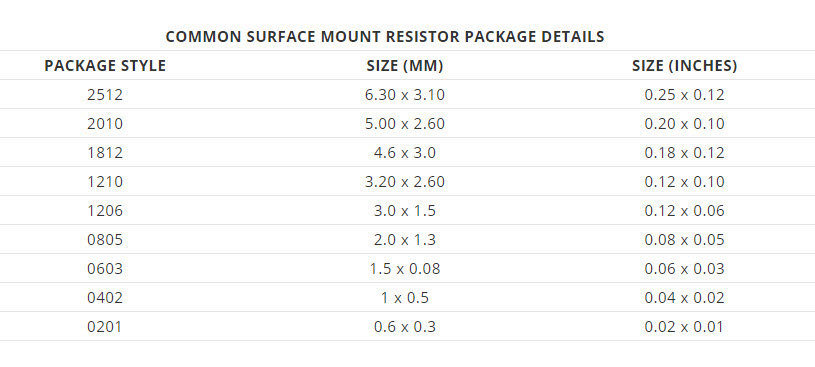

# Atlantix-EDA
Programmatically generated PCB libraries facilitating robust electronic product design.

Atlantix-EDA enables electronic engineers to have fully customizable, rich libraries to employ in designs.
The Atlantix-EDA software tool suite *value position* is based upon programmatically generated libraries for PCB Design
with the advantages of:

   - Rapid design creation with consistant and comprehensive PCB libraries.

   - Higher productivity for individual engineers doing schematic, pcb, firmware, etc.

   - Versatile and flexible, as the libraries are programmatically generated by this software.

## Running the Example

The primary example is to generate the Vishay resistor series from 0402, 0603, 0805, 1206, 1210. To run the example, just pull this repository and
then: 

```terminal
cargo build 
cargo run --example gen_vishay_resistor
```
then you will see in the terminal 
```terminal
cargo run --example gen_vishay_resistor
    Finished dev [unoptimized + debuginfo] target(s) in 0.01s
     Running `target\debug\examples\gen_vishay_resistor.exe` 
** Success::0402 component::Resistor E-96 series generation (1 Ohm to 1 MOhm).

** Success::0603 component::Resistor E-96 series generation (1 Ohm to 1 MOhm).

** Success::0805 component::Resistor E-96 series generation (1 Ohm to 1 MOhm).

** Success::1206 component::Resistor E-96 series generation (1 Ohm to 1 MOhm).

** Success::1210 component::Resistor E-96 series generation (1 Ohm to 1 MOhm).
```

The file data.txt will then be generated with the CSV file that can be imported into Altium. 

 ## Software

 This software platform is built with the [Rust](https://www.rust-lang.org/) programming language, offering a very robust
 systems programming language that is type and thread safe. Rust was chosen as the software for Atlantix-EDA
 because of these features and a forward looking vision incorprating advanced capabilities.

# License

Licensed under GNU General Public License (GPL).

Copyright, 2006-2020, Atlantix-EDA, Atlantix Engineering <fpga@atlantixeng.com>

# Integration

Altium for example has the database import described
here:   

<https://www.altium.com/documentation/altium-designer/working-with-database-libraries-ad>

Other tools such as KiCad, Fusion360(Eagle), Cadence Allegro, and Mentor PADS have not
been tested with the current Rust version of the software.
PADS was tested with an older version of this software so it should easily be adopted.
Tools such as the [KiCad]( https://gitlab.com/kicad/libraries/kicad-library-utils) generator functionality could
be replaced by Atlantix-EDA generate module, with the help of templating to take care of
boilerplate code in the resistor library. A template engine such as [Askama](https://djc.github.io/askama/) would be a good
approach.

Overall, resistor libraries for Altium are included as part of this repo that include
every E-96 value from 0201 to 2512, which is over 5,000 parts.

# Background

For a complete resistor library from 0201 to 2512 in the E-96 1% series there are 5,184 resistor values. The ability to generate these libraries on the fly
and change any data associated with each part is quite powerful.

The use of Atlantix-EDA to generate the resistor library enables engineers developing in tools such as Altium, KiCad, etc. to have a comprehensive library 
available to them. This library enables quicker design cycles by
eliminating part creation and more robust design as BOM generation from the schematic will be accurate and true.



A history and more complete background of the [resistor series.](https://en.wikipedia.org/wiki/E_series_of_preferred_numbers "Wikipedia resistor series background")


## Basic usage example
This basic example shows the generation of a 0603 library with
the decades ranging from 1 ohm to 1 Meg-Ohm

```rust
let decades = [1,10,100,1000,10000,100000];
let mut r0603 = generate::Resistor::new(96, "0603".to_string());

for decade in decades.iter() {
r0603.generate(*decade);
}
```

## Detailed usage example
The code below shows how to actually instantiate the resistor object and generate
values across several decade values while writing to a file, which is then imported
by Altium or another tool.

```rust
fn main() {
 	let decades = [1,10,100,1000,10000,100000];
	let mut name_0402 : String = " ".to_string();

	let mut r0402 = generate::Resistor::new(96, "0402".to_string());

	for decade in decades.iter() {
		name_0402 = r0402.generate(*decade);
	}

 	let mut file = OpenOptions::new()
                       .write(true)
                       .truncate(true)
                       .open("data.txt")
                       .expect("cannot open file");

			file.write_all(name_0402.as_bytes()).expect("write failed");

			println!("** Success::0402 resistor generation.");
 	}
```


